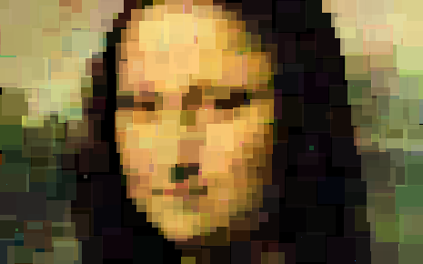

% TP : Algorithmes génétiques
% Quentin de Laroussilhe et Guillaume Sanchez

\tableofcontents
\newpage

# Introduction

Dans ce TP vous allez être amené à réaliser un algorithme génétique qui va
chercher à reproduire une image modèle à l'aide de n carrés de couleurs et de
tailles différentes disposées à des positions différentes sur l'image. Le
génome représentera l'ensemble des carrés à dessiner pour obtenir la
reproduction.

Vous pourrez voir l'image se dessiner et admirer votre population
évoluer sous vos yeux.

Aucun langage n'est imposé, libre à vous de choisir celui avec lequel vous êtes
le plus à l'aise !

\newpage

# Des fonctions de dessin

Avant de commencer à bourriner de l'ADN, vous allez devoir commencer par écrire
les fonctions vous permettant de manipuler votre image.

Afin de simplifier le travail en C#, je vous recommande d'utiliser SDL.NET
plutôt que XNA (sauf si vous savez manipuler les surfaces avec XNA).

## Dessine moi un carré

Ecrire une fonction dessinant un carré sur une surface, avec la taille, les
trois composantes RGB de la couleur, et la position en paramètre.

## Comparaision d'images

Afin de déterminer le fitness de vos individus (et donc de vos images), il est
nécessaire de pouvoir évaluer la ressemblance d'une image générée à partir d'un
code ADN et le modèle.

Pour cela, vous allez utiliser un algorithme simple, de complexité $n^2$ qui va
parcourir chaque pixel de votre image et calculer la moyenne de la somme de la différence
de chaque composante RGB de chaque pixels[^1].  
Ce chiffre sera donc compris entre 0 et $255*3$

Vous venez de coder la fonction de fitness de votre algorithme génétique.

[^1]: Je n'ai pas plus clair, désolé !

### Prototype  
Surface x Surface $\to$ entier

## Vérification

Pour vérifier vos fonctions, initialisez deux surfaces de taille 800x800,
dessinez à l'aide de la première fonction un carré de taille 800x800 à la
position (0,0) de couleur (8,10,24) sur la première surface. Sur la deuxième
surface, dessinez un carré de taille 800x800 à la position (0,0) de couleur
(0,0,0).

Comparez les deux surfaces et vérifiez que le résultat donné est bien 42.

# Un génome

On attaque (enfin) le vif du sujet. Vous allez être amené à réaliser la
structures de données que votre algorithme génétique va manipuler : un génome.
C'est sur cette structure que vont être effectuées l'ensemble des mutations,
croisements et autres opérations qui vont conduire à faire tendre votre image
vers l'image modèle.

## Les gènes

Votre génome sera constitué de plusieurs gènes. Il serait donc intelligent de
commencer par définir un gène. Un gène décira les caractéristiques (taille,
position...) d'un carré. Le génome, constitué de plusieurs gènes sera le "plan
de construction" de votre image.

Créez donc une structure (ou classe) décrivant un gène. Un gène contient :

* Deux variables x et y pour la position du carré
* Trois variables r, g, b pour la couleur du carré
* Une variable size pour la taille du carré

### Randomisation
Au début de votre algorithme génétique, vous serez amené à générer des génomes
aléatoires pour chaqun de vos individus.  
Codez donc une fonction qui crée un gène aléatoire. Les coordonnées x et y et
size seront indiquées en pourcentage et donc comprises entre 0 et 100, 
{r, g, b} entre 0 et 255.

### Mutation

Le rôle des mutations est de permettre l'apparition de nouveaux caractères au
sein des individus.  
Codez une fonction qui randomize le gène en appelant la fonction codée
précédemment avec une probabilitée de $1/n$ a avec n passé en paramètre.

## Le génome

Il est temps de créer une structure de donnée (struct ou classe) destinée à 
représenter l'ADN de vos individus. Celle-ci doit contenir une liste de gènes,
qui constituent l'ensemble des carrés à dessiner sur l'image ainsi qu'un
fitness (ou score) valant initialement 0.

### Génération

Vous coderez une fonction générant un génome contenant 400 gènes aléatoires à
l'aide de la fonction de randomisation des gènes.

### Mutation

Il est nécessaire de pouvoir faire muter l'ensemble du génome. Pour cela, on
parcours la liste de gène et on appèle la fonction de mutation pour chaque
gène.

### Croisement

Vous allez commencer par écrire la fonction destinée à mélanger deux ADN pour 
former un nouvel individu.

L'algorithme de coït-fecondation va parcourir le génome des deux individus et
pour chaque gène on tire au sort l'un des individus afin de former le nouveau
génome.

Le nouveau génome sera donc constitué de la moitié (environ) des gènes du père,
et de la moitié des gènes de la mère.

### Evaluation

Pour pouvoir séléctionner les meilleurs individus, il faut être capable de
déterminer le score de chaque individu. Il va donc falloir rmeplir la variable
fitness du génome.

Commencez par générer l'image (la surface) correspondant à votre génome. Pour
cela, créez une surface puis parcourez la liste de gènes de votre génome. Pour
chaque gène, appelez la fonction de dessin de carré avec les bons arguments.

Une fois tous les gènes dessinés, vous obtenez l'image décrite par votre génome
et vous pouvez l'évaluer.

Comparez l'image obtenue avec le modèle en utilisant la fonction de
comparaison. Le fitness que vous placerez dans votre structure de donnée
correspondant au génome sera égal à 756 - comparaison(surface_genome, modele)

## Population

La population sera tout simplement une liste de génomes.

### Initialisation

Créez une fonction d'initialisation de votre population, prenant la taille de
la population en paramètre et le nombre d'individus.

Remplissez la liste de génomes générés aléatoirement à l'aide des fonctions
précédemment codées.

### Séléction

Il va être nécessaire de séléctionner les meilleurs individus de votre
population.

Pour cela, commencez par évaluer (en utilisant la fonction codée précédemment)
chaque génome de la liste, puis triez la liste en fonction de la valeur du
fitness de chaque élément.

Enfin, codez une fonction select, qui retournera un "bon individu" :

~~~
Pour chaque individu de la_population_triée
    Si (une_chance_sur_deux) alors
        retourne individu
    fin si
fin pour
retourne dernier_individu_de_la_population
~~~

### Reproduction

La partie marrante commence puisqu'on va coder un superbe algorithme de
gang-bang pour la population !

Le but est ici de générer une nouvelle population à partir de la génération
courrante.

Pour cela, on va remplir une nouvelle liste de génome (i.e une nouvelle 
population) de génomes croisés. Pour cela, on crée une nouvelle liste, et on
ajoute les élements au fur et à mesure, en utilisant la fonction de croisement
que vous avez déjà codé, en passant en paramètre deux individus selectionnés à
l'aide de la fonction de séléction.

Ainsi, un bon individu à des chance de se reproduire puisqu'il a des chances
d'être tiré au sort pour être croisé avec un autre individu.

Tout comme les êtres vivants, la reproduction ne fonctionne pas toujours très
bien, on va simuler ce processus en appelant la fonction de mutation sur chaque
génome de la population crée.

# Faisons marcher le tout !

## Algorithme génétique

Implémentez l'algorithme génétique à l'aide de toutes les fonctions que vous
avez réalisé.

~~~
Initialiser la population aléatoirement avec n individus
Tant que vrai
    Muter la population
    Trier la population en fonction du fitness
    Si le meilleur individu est satisfaisant
        retourner l'individu
    Créer une nouvelle population
    Pour i = 1 to n faire
        Choisir deux bons individu
        Les croiser et les ajouter dans la
            nouvelle population
~~~

## Interface et affichage

Pensez à afficher à l'ecran le meilleur individu toutes les 10 ou 20 générations
afin de visualiser l'avancée de la recherche.

Affichez le meilleur fitness en pourcentage pour constater la convergence de
l'algorithme.
